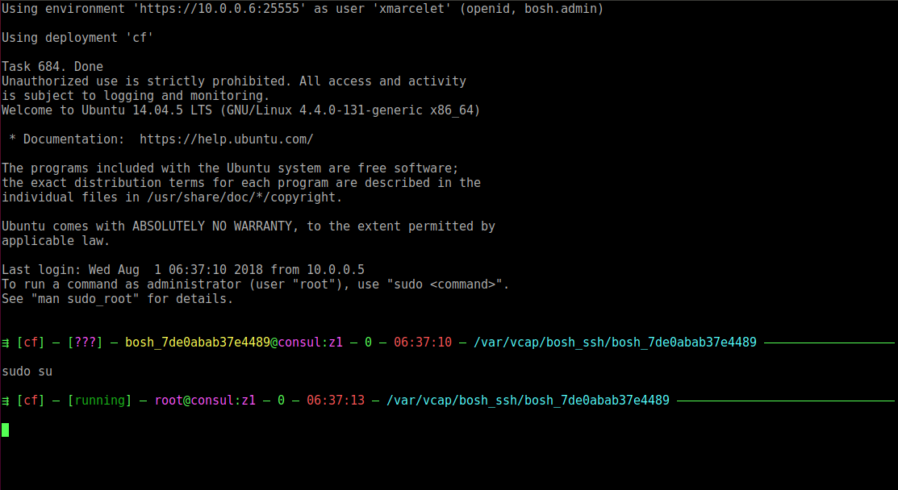

## BOSH Linux Psycofdj's Release

Configures bashrc to ease day-to-day operations.

- installs shell prompt that displays usefull information
- define custom aliases
- define bash helpers functions to navigates to jobs, packages and logs directory
- installs bash completion for monit

## Details

#### Prompt



Fields:

- current deployement
  - (red) for cf
  - (cyan) for prometheus
  - (yellow) default

- current monit status (root user only)
  - (green) all running
  - (red) at least 1 faulty job

- current user
  - (magenta) for root
  - (yellow) default

- instance name and zone
  - (magenta) for *important* products like database, consul or singleton-blobstore
  - (red) for *controle-plane* products like router, tcp-router and diego-cell
  - (yellow) default

- last shell status
  - (green) for 0
  - (red+blink) defaults

- last prompt datetime (red)

- current cwd (cyan)

#### Aliases

- rm : `rm -i`
- l : `ls -chl --color=auto`
- ll : `ls -chla --color=auto`
- p  : `pwd`
- h : `cd ~`
- k : `cd ..`
- c : `clear`
- ps : `ps auxw  --sort=uid,pid,cmd`
- sudo : `sudo `
  - this one allow to use aliases in sudo commands
- ios : `iostat -xm 1`
- s : `monit summary`

#### Helpers

- `list-jobs` : display list of installed jobs
- `list-packages` : display list of installed packages
- `go-job <job>` : (+completion) change directory to given job
- `go-package <package>` : (+completion) change directory to given package
- `go-logs <job>` : (+completion) change directory to given job's logs
- `logf <job> [all]` : (+completion) tail logs for given job. When all is given, all logs files are displayed.
- `monit <args...>` : (+completion) adds completion to monit commands

## Usage

Include the job in all instance_groups running with ubuntu stemcell:

```yaml
addons:
- name: psycofdj
  include:
    stemcell:
    - os: ubuntu-trusty
  jobs:
  - name: psycofdj
    properties: {}
    release: psycofdj

releases:
- name: psycofdj
  version: "2.0"
  url: https://github.com/psycofdj/psycofdj-release/releases/download/1.0/psycofdj-2.0.tgz
  sha1: ...
```
